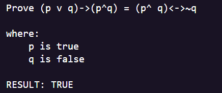
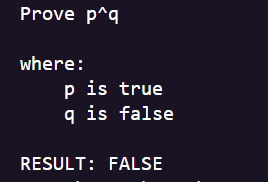
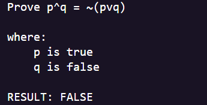

# Math-Logic-Prover
A modified version of my Pemdas calculator program but with mathematical logic

The program accepts string input and outputs a boolean value

##Sample inputs
###input 1

###input 2

###input 3

